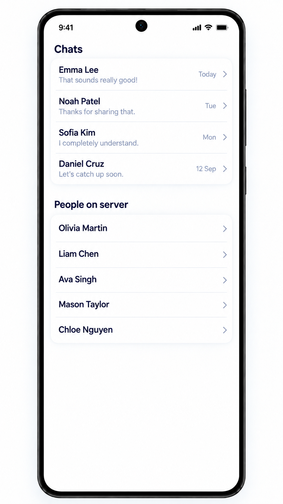

# Chat list screen

Shared iOS/Android reference; light mode only. This is the second main screen,
owned by `UserList` / `userlist`, not the single-conversation feature.
See the [catalog](README.md).

## Visual structure and content

Use two vertically arranged sections with dark headings, rounded light containers,
row separators and trailing navigation chevrons:

- **Chat**: one row per existing local conversation, showing the peer's name,
  latest message preview and date when available. The image says "Chats"; use
  "Chat" to follow the developer's explicit requested copy.
- **People on server**: names of registered users with whom the current user has
  no local conversation. Do not show the current user or duplicate IDs.

Example names, dates and messages are illustrative. Both sections must remain
reachable with long lists and larger text; the image does not require two nested,
independently scrolling lists. Distinct users can share a display name.

## Data and navigation

Load the upper section from the local database and observe committed changes.
Fetch the lower section using `GET /users` after identification and on refresh or
retry; upsert by ID and filter self and existing conversation participants.
Registration does not mean online presence: do not add online status indicators.

Tapping a row in either section opens [messages](messages-screen.md) for that peer.
For a new conversation, get or create the local conversation idempotently before
navigating; do not send a greeting or create a message automatically. Returning
from messages shows this list with updated summaries and membership. An existing
empty local conversation still belongs in the upper section.

## Loading, empty and error states

- Essential initial local reads may use [full-screen loading](loading-screen-component.md).
  A successful empty local list is ready, not a reason to continue loading.
- A failed essential local read may use the [error screen](error-screen.md).
  A row's failed conversation-creation operation stays contextual and does not
  discard a usable list or navigate as if its write succeeded.
- Remote discovery has section-local loading, list, empty and error/retry states.
  Its successful filtered-empty copy is "No other users available right now".
  `GET /users` failure must not replace the whole screen with loading or error.
- After completed registration, offline/connecting/synchronizing indicators remain
  secondary; users can still open their local conversations.

See [shared list behavior](../../SYSTEM_DESIGN.md#conversations-and-registered-users),
[sign-up entry](sign-up-screen.md), [persistence](../persistence.md) and
[acceptance checks](../acceptance-tests.md#shared-visual-and-flow-acceptance).
