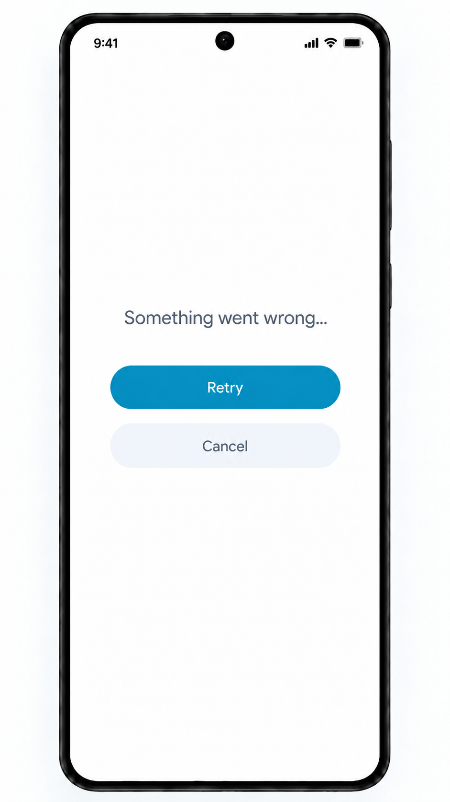

# Essential-operation error screen

Shared iOS/Android reference; light mode only. A reusable full-screen presentation
when a failed essential operation prevents continuing safely. See the [catalog](README.md).

## Visual structure and error text

A white surface replaces the unavailable screen. Show a centered explanation,
a prominent rounded blue/cyan "Retry" button, and a secondary light-gray "Cancel"
button underneath. The prototype's "Something went wrong..." is fallback copy;
display a valid server `userMessage` when one exists. Never expose `developerMessage`,
raw transport diagnostics or stack traces. Preserve readability for longer errors.

Networking exposes typed failures; the owning operation determines recovery.
The visual component receives display content and available actions, not raw JSON
or a socket. See [typed error ownership](../../SYSTEM_DESIGN.md#error-presentation-and-ownership).

On iOS the reusable `ErrorScreen` receives the display message and Retry closure.
Its Cancel button calls SwiftUI's environment dismiss action, revealing the
presentation's underlying content. The owning flow remains responsible for
choosing a safe presentation context and for the retry operation itself. Its
preview demonstrates both Retry and dismissal behavior.

On Android, `ErrorScreen` receives the display message plus explicit `onRetry` and
`onCancel` callbacks. The presentation owner implements Cancel by removing the
error presentation and revealing the underlying content. This is the Compose-native
equivalent of environment dismissal and is demonstrated by its preview.

## Essential failures and actions

- **Initial registration:** a failure to save identity, connect, identify, decode
  acceptance or persist completion prevents opening the chat list. Retry returns
  to [loading](loading-screen-component.md) and safely resumes the operation with
  the same identity. Cancel returns to the prefilled [sign-up form](sign-up-screen.md).
- **Essential local history read:** Retry reloads local history; Cancel returns
  to the [chat list](chat-screen.md) if that destination is usable.
- **Root local-data failure:** Retry reattempts the read. Do not offer a Cancel
  action that navigates to unavailable data, creates a replacement identity or
  reports success. Hide/disable actions without a safe destination and explain
  the limitation in the implementation's documentation.

The image illustrates a retryable failure. For a permanent rejection, do not
offer unchanged automatic retries: keep Cancel/return-to-input available when
correction is possible, and enable Retry only after its prerequisites are met.
Respect `isRetryable`, session ownership and backoff from the
[protocol](../protocol.md#codes-and-retry-eligibility). A transport or storage
failure is a local failure, not a fabricated server error.

Prevent concurrent retry attempts and ignore stale results after cancellation.
Cancel does not undo accepted server work or delete durable local content.

## Do not use it for every error

Failure of `GET /users` stays within the lower [chat-list section](chat-screen.md).
Ordinary connection failure after registration keeps available history visible.
Outgoing-message failures stay attached to their [message](messages-screen.md);
a failed compose/save operation retains the user's draft. None of these failures
alone requires replacing the entire usable screen.

See [shared state boundaries](../../SYSTEM_DESIGN.md#screen-loading-and-state-dimensions)
and [acceptance checks](../acceptance-tests.md#shared-visual-and-flow-acceptance).
