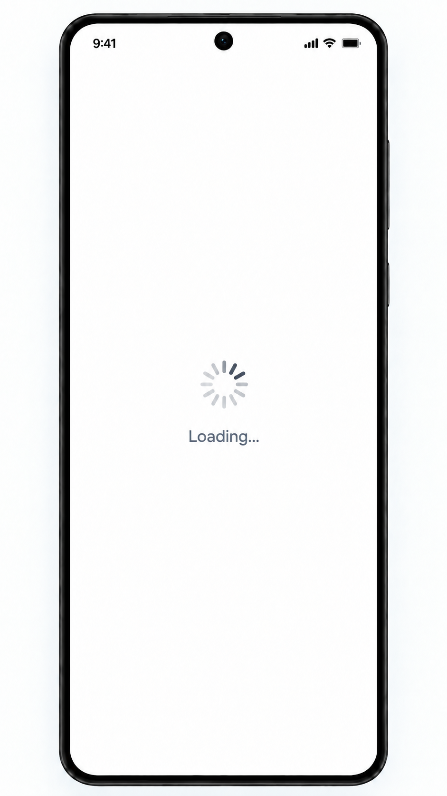

# Full-screen loading component

Shared iOS/Android reference; light mode only. A reusable presentation of an
essential operation in progress, not a separate main screen. See the [catalog](README.md).

## Appearance and ownership

An opaque white app surface hides the underlying screen, with a centered progress
indicator and "Loading..." beneath it. Do not leave underlying content visible,
tappable or accessible to screen readers. A native animated indicator may express
the same indeterminate progress on each platform; do not render the PNG as the UI.

The component only renders supplied state. The feature ViewModel or flow owner
starts/cancels work and transitions to ready or error. Present accessible progress
without fabricating percentages. Repeated rendering must not start another request.

## When to use it

| Operation | Full-screen loading? | Completion / failure |
| --- | --- | --- |
| First valid sign-up confirmation | Yes, immediately. | Identity accepted and local completion committed → chat list; essential failure → error. |
| Essential initial identity, conversation or history read | Yes, while the screen cannot safely render. | Successful read, including empty data → ready; read failure → error. |
| Registered-user discovery or refresh | No; section-local progress. | Update only the lower chat-list section. |
| Reconnection/replay after completed registration | No; secondary connection indicator. | Preserve local history and offline composition. |
| Sending a message / waiting for sender ACK | No; per-message progress. | Observe persisted message state. |

The initial registration exception does not turn every network request into a
blocking operation. End loading on success, failure or cancellation; a stalled
essential network attempt must reach a bounded timeout/recovery state. Do not gate
ready local content on `sync_completed` or discovery completion.

See [sign up](sign-up-screen.md), [chat list](chat-screen.md),
[messages](messages-screen.md), [error recovery](error-screen.md) and
[independent state dimensions](../../DESIGN.md#screen-loading-and-state-dimensions).
