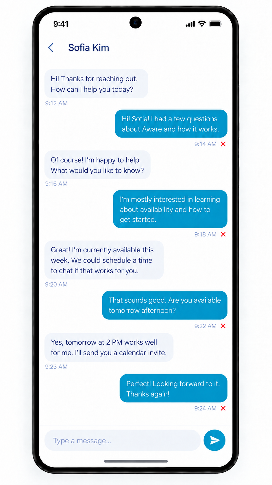

# Messages screen

Shared iOS/Android reference; light mode only. This is the third main screen,
owned by `Chat` / `chat`. See the [catalog](README.md).

The failure prototype is an additional state of this same screen, not a separate
screen or navigation destination.

## Visual structure

- Header: back indicator followed by the other participant's display name.
  Back returns to the [chat list](chat-screen.md), without stopping app-scoped messaging.
- Incoming messages: rounded light-gray cards aligned left, dark text, and receipt
  time below each card, also aligned left.
- Outgoing messages: rounded blue/cyan cards aligned right, white text, and sent
  time below each card, with the server-ACK indicator alongside that time.
- Bottom composer: rounded light input with "Type a message..." placeholder and
  a circular blue/cyan send button containing a send-arrow icon.

Keep messages readable and scrollable above the composer, including when the
keyboard appears. Allow wrapping and larger accessibility text. Header names and
message content are real data, not the sample conversation in the PNG. Use cached
peer names or a neutral fallback while discovery is unavailable; names do not route
messages. No attachment, audio, presence or read-receipt controls are required.

## Timestamps and ACK meaning

The single checkmark appears only for persisted `sent` after the corresponding
`message_accepted`. Writing to the socket is not sufficient. The mark means
**accepted by the server**, not received on the other device, read, or durably
stored by the server. `message_persisted` is a different ACK and does not produce
a second checkmark on the sender's screen.

| Outgoing state | Presentation requirement |
| --- | --- |
| `pendingToSend` | Visible queued message; pending indication, no acceptance checkmark. |
| `sending` | Waiting-for-ACK indication, no acceptance checkmark. |
| `sent` | One server-acceptance checkmark next to the time. |
| `failed` | One red X next to the time, replacing the acceptance checkmark. |

The original PNG shows accepted outgoing messages; the failure PNG defines the
failed state. `sending` shows neither a checkmark nor an X. Incoming messages
never show an ACK icon, regardless of any state value supplied to a reusable view.
Icons require accessible labels so status does not depend on color alone. Do not
invent delivery or read states.

For outgoing messages, show the original `clientCreatedAt` (the user's send/queue
action); an offline retry must not change the displayed time. For incoming
messages, show the client's first successfully stored receipt time, using
client-only `receivedAt` metadata. Do not mistake `serverReceivedAt` (server
acceptance) for device receipt. Persist receipt time once and keep it on duplicates
and relaunch. See [timestamp storage](../persistence.md#display-timestamps).
Format times for display separately from the UTC wire encoding; the sample times
are not hardcoded data or a global message-ordering rule.

On iOS, `MessageContainer` receives `Origin`, message text, `Date`, and
`ACKMessageState`. It uses the localized `Date.messageTime` display extension;
that extension does not change protocol timestamp encoding. Android implements the
equivalent `MessageContainer` with `MessageOrigin`, message text, `Instant`, and
`AckMessageState`; `Instant.toMessageTime()` provides the localized display value.
Both implementations use native types/tokens without changing wire timestamp rules.

## Behavior and recovery

Load and observe local history by `conversationId`. Use
[full-screen loading](loading-screen-component.md) only while essential local
history is unavailable, and [full-screen error](error-screen.md) if that read fails.
An empty conversation is ready and allows composing its first message.

Validate non-blank input. Commit an outgoing message and its sequence before
displaying it as queued or sending it. Keep typed text if that save fails. Sending
uses the app-scoped service; it does not replace the whole conversation with loading.
Keep history and offline composition usable during reconnection and replay.

Incoming messages are persisted before recipient ACK, even with this screen
closed. Observe ACK/state updates without reopening the conversation. Preserve
the [shared send/recovery rules](../../SYSTEM_DESIGN.md#sending-messages),
[wire ACK contract](../protocol.md#sending-and-sender-ack) and
[client acceptance checks](../acceptance-tests.md#shared-visual-and-flow-acceptance).
