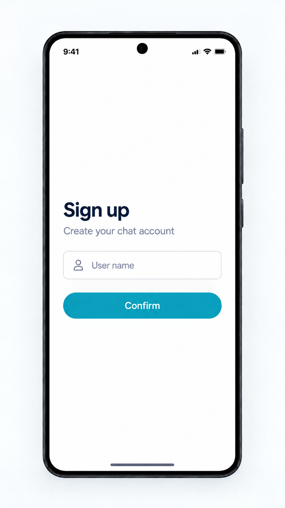

# Sign-up screen

Shared iOS/Android reference; light mode only. This is the first main screen,
owned by the identification feature. See the [catalog](README.md).

## Visual structure

A white screen with generous whitespace, a prominent "Sign up" heading,
"Create your chat account" subtitle, outlined "User name" field with a person
icon, and a rounded blue/cyan "Confirm" button. Preserve this hierarchy while
allowing the form to remain usable with the keyboard and larger accessibility text.
The subtitle is prototype copy: the MVP has device identity, not authentication,
passwords, unique handles or cross-device account recovery.

## Confirmation and navigation

1. Require a non-blank display name. Local input validation stays with the form;
   do not start a request for blank input. Names are not unique identifiers.
2. On a valid **Confirm**, immediately replace the form with
   [full-screen loading](loading-screen-component.md). Prevent duplicate submission.
3. Generate one UUID if needed and commit the identity locally before network use.
   Reuse the same saved UUID when retrying an incomplete registration.
4. Open the existing `/ws` connection and send `identify` with the saved UUID/name.
   Registration is this WebSocket operation; there is no registration HTTP endpoint.
5. Wait for a valid `identity_accepted` for this identity and active attempt, then
   persist local registration completion. Only then navigate to the
   [chat list](chat-screen.md). An open socket or successful write is not success.
   Do not wait for `GET /users` or `sync_completed` to complete registration.
6. A storage, transport, timeout, decoding or registration rejection that prevents
   completion replaces loading with the [error screen](error-screen.md).

Use one active registration attempt and ignore stale results after cancellation
or replacement. A request must not leave the user in an endless spinner: define a
bounded client operation timeout when implementing this flow and expose recovery.
The protocol's sender-message ACK timeout is a separate policy, not a server
registration deadline.

## Recovery and relaunch

Retry returns to loading and resumes the failed operation safely, retaining the
UUID and name. Cancel returns to the form with the entered name; it does not
advance to the chat list or delete the saved identity. Input-related permanent
errors require correction before resubmission, not automatic unchanged retries.
Cancel invalidates the active UI attempt; it cannot undo a registration the server
already accepted. A later attempt may safely identify with the same UUID on a new
connection.

A saved identity alone is not completed registration. Persist a client-only
completion marker as described in [persistence](../persistence.md#registration-completion).
If registration never completed, relaunch returns to the prefilled form and reuses
the identity. After completion, skip this form on later launches and allow offline
access to existing local content while re-identifying in the background.

## Related contracts

- [Shared identification flow](../../SYSTEM_DESIGN.md#user-identification).
- [WebSocket identification](../protocol.md#identification-and-synchronization).
- [Essential errors and actions](error-screen.md).
- [Client acceptance checks](../acceptance-tests.md#shared-visual-and-flow-acceptance).
